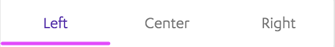

# TabsMenu

This project showcases an example of how to build a *Reusable Tabs Menu
Component* using *Kony Visualizer*. The Visualizer project just serves as a
wrapper to demo the component. The component -called
`com.mig82.TabsMenu` is the real focus of this exercise.

## External Dependencies

This project uses AmplifyJs's core module. This is bundled within the component
so once the component is imported this Javascript module will be added to the
project's global `modules` directory.

## Implementation Notes

This project was built using Kony Visualizer Visualizer 8.4.22.

## Other Considerations

This tabs menu is designed to create the illusion that when navigating between
two forms that have it, the header is fixed and only the content of the rest of
the screen changes. For this to work, make sure that both `IN` and `OUT`
transitions of all your forms are set to `None`.
